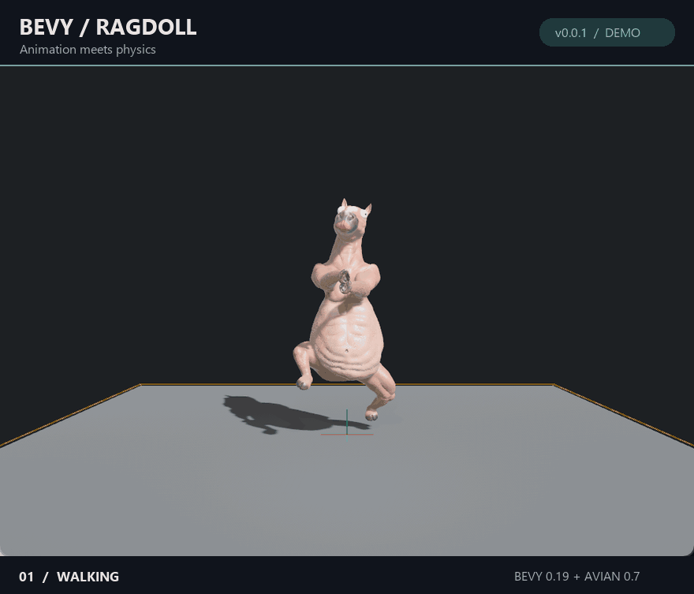

# bevy-ragdoll0.0.1

A small Rust test project for animated models and ragdoll physics, using Bevy 0.19 and Avian 0.7.



*Recorded in the running app: two animations, then a switch to ragdoll physics.*

## Run

Install Rust, then run from the project folder:

```sh
cargo run --locked
```

The model and texture files are included in the project root. Keep them there: the viewer loads assets from that directory.

## Controls

- `1` / `2`: select an animation.
- `Enter`: cycle animations.
- `R`: toggle ragdoll mode.
- Left mouse button: grab and throw ragdoll parts.
- Right mouse button: capture the cursor for the free camera.

The `backups/` directory contains earlier experiment snapshots.
